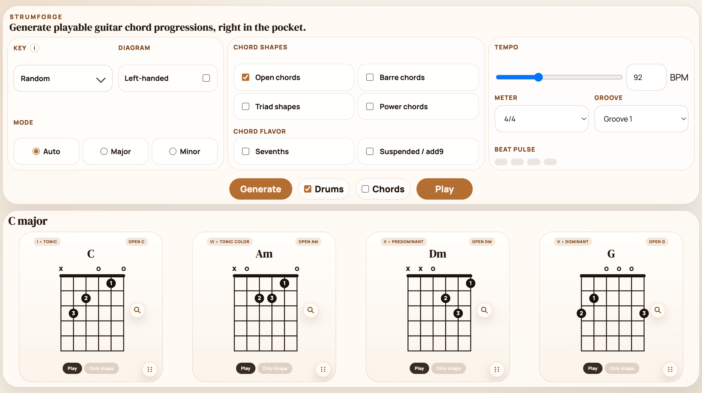

# StrumForge

`StrumForge` is a compact guitar practice tool with playable chord progressions, diagrams, and a built-in groove.

[Try it here.](https://adamspain.com/strumforge/).  

## License

Copyright (c) 2026 Adam Spain. All rights reserved.

No license is granted for use, copying, modification, or distribution of this code without prior written permission.
