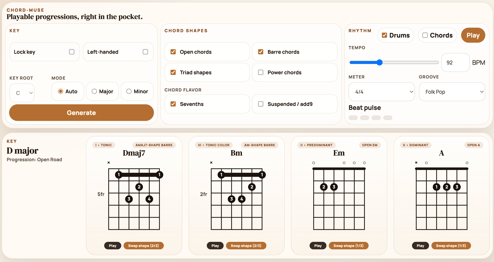

# chord-muse

`chord-muse` is a simple practice tool for guitar players.

It gives you a playable 4-chord loop, shows you chord diagrams, and lets you practice with a built-in groove.

## [Try it here](https://adamspain.com/chord-muse)

## Features

- Generate a new chord progression with one button
- Keep the key fixed or let the app choose one for you
- Stick to easier shapes like open chords, or add barre, power, and multi-string-set triad shapes
- Turn on sevenths or suspended/add9 chords for more color
- Play along with drums and a tempo control
- Flip the diagrams for left-handed players
